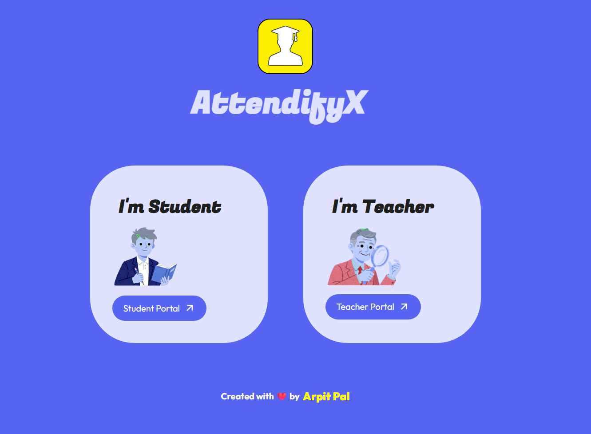
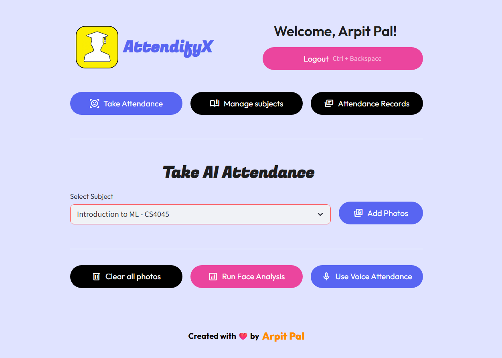
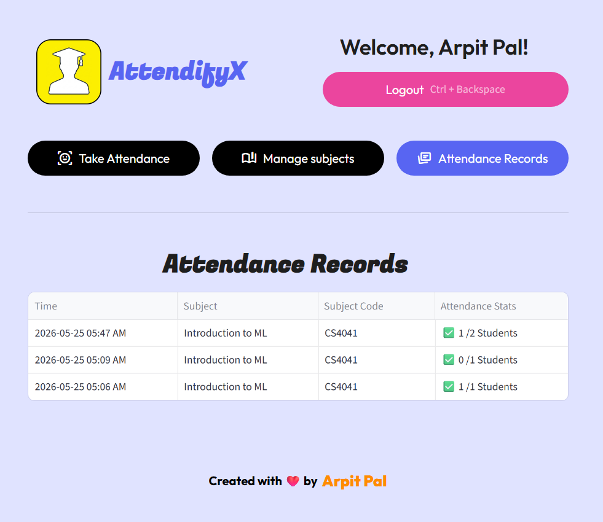

# AttendifyX: Intelligent AI Attendance System

AttendifyX is an AI-powered attendance management application that automates classroom attendance using face recognition and voice recognition. It is built with `Streamlit` for the user interface, `Supabase` for backend storage, and machine learning pipelines for biometric identification.

The project is designed as a practical demonstration of how AI can be used in an education workflow to reduce manual attendance work, organize subject-wise records, and provide separate student and teacher experiences.

## Overview

AttendifyX provides two main workflows:

- a **student portal** for face-based login, new profile registration, optional voice enrollment, subject enrollment, and attendance tracking
- a **teacher portal** for subject creation, student attendance using face and voice input, and attendance record management

The system combines:

- face recognition for student identification
- voice recognition for optional attendance support
- subject and enrollment management
- attendance logging and history
- role-based dashboards for students and teachers

This makes the project useful both as:

- a learning project for AI-powered attendance systems
- a portfolio project for Python, Streamlit, and Supabase development
- a practical prototype for biometric classroom attendance

## Live Links

- **Main Streamlit App:** https://attendifyx-main.streamlit.app/
- **Project Landing Page:** https://attendify-x-landing-page.vercel.app/
- **Landing Page GitHub Repository:** https://github.com/AP16112/AttendifyX-Landing_Page

Alongside the main Streamlit application, a separate landing page was also designed and deployed for AttendifyX to give the project a more polished public-facing presentation. The landing page is hosted on Vercel, and its source code is maintained in a dedicated GitHub repository.

## Why This Project

Traditional attendance systems are often:

- slow
- repetitive
- manual
- difficult to scale
- vulnerable to human error and proxy attendance

AttendifyX aims to improve this process by identifying students through biometric signals and automatically organizing attendance data. Instead of relying completely on manual roll calls, the system uses face and voice recognition to assist teachers and simplify attendance workflows.

## Problem Statement

In many classrooms, attendance still consumes valuable teaching time. Teachers often need to:

- call student names one by one
- maintain records manually
- verify whether attendance is genuine
- organize attendance separately for different subjects
- answer student questions about attendance records later

AttendifyX addresses this by building a subject-aware attendance system where:

- students can register and log in using FaceID
- teachers can take attendance using classroom images or audio
- attendance is logged automatically in the backend
- students can later view their own records

## What The Project Does

The application supports:

- student login using face recognition
- new student registration when a face is not recognized
- optional voice enrollment during registration
- teacher account creation and login
- subject creation and management
- student enrollment into subjects
- face-based attendance using classroom/group images
- voice-based attendance using classroom audio recordings
- teacher attendance record viewing
- student attendance history viewing

## Key Features

- Streamlit-based interactive interface
- Role-based access for students and teachers
- Face-based student recognition workflow
- Voice enrollment for optional voice attendance
- Subject creation and enrollment system
- Teacher dashboard for attendance operations
- Attendance result dialogs and logging flow
- Supabase-backed storage for biometric data and attendance history
- Cached AI model loading for better performance

## Demo

### Home Screen



### Student Login / Registration


### Teacher Dashboard



### Attendance Results



## Tech Stack

- Python
- Streamlit
- Supabase
- NumPy
- Pandas
- scikit-learn
- dlib
- face_recognition_models
- librosa
- Resemblyzer
- Pillow
- bcrypt
- segno

## Project Structure

- `app.py` - Streamlit app entrypoint and routing logic
- `src/screens/home_screen.py` - home screen and initial user flow
- `src/screens/student_screen.py` - student login, registration, enrollment, and dashboard flow
- `src/screens/teacher_screen.py` - teacher login, subject management, attendance, and records flow
- `src/pipelines/face_pipeline.py` - face detection, embedding generation, and recognition logic
- `src/pipelines/voice_pipeline.py` - voice embedding generation and speaker matching logic
- `src/database/config.py` - Supabase client setup using Streamlit secrets
- `src/database/db.py` - database helper queries
- `src/components/` - reusable dialogs, cards, headers, and footers
- `src/ui/base_layout.py` - custom Streamlit styling
- `requirements.txt` - project dependencies
- `.gitignore` - ignored files and folders

## How It Works

1. A student visits the student portal.
2. The student scans their face using the camera input.
3. If the face matches an existing profile, the student is logged in.
4. If the face is not recognized, the student can register a new profile.
5. During registration, the face embedding is stored in the database.
6. The student can optionally record voice input for voice-based attendance.
7. Teachers create subjects and share subject codes with students.
8. Students enroll into subjects.
9. Teachers take attendance using face photos or classroom audio.
10. Attendance records are stored and displayed in teacher and student dashboards.

## Student Workflow

### 1. Face Login

Students use the camera input to scan their face for login.

### 2. New Student Registration

If the face is not recognized, the student can:

- enter their name
- optionally record a voice sample
- create a new student profile

### 3. Subject Enrollment

After login, students can join subjects using subject codes shared by teachers.

### 4. Attendance Tracking

Students can view:

- enrolled subjects
- attended classes
- total classes
- subject-wise attendance history

## Teacher Workflow

### 1. Teacher Login / Registration

Teachers log in using credentials or create a teacher profile.

### 2. Subject Management

Teachers can:

- create subjects
- view subject codes
- see enrollment counts
- share join links or codes

### 3. Face Attendance

Teachers can upload or capture classroom/group images and let the face pipeline identify recognized students.

### 4. Voice Attendance

Teachers can record classroom voice input and use the voice pipeline to identify enrolled students who have voice profiles.

### 5. Attendance Records

Teachers can view subject-wise attendance logs and attendance summaries from the dashboard.

## Face Recognition Pipeline

The face recognition workflow is implemented in `src/pipelines/face_pipeline.py`.

At a high level, it performs:

1. face detection using Dlib
2. landmark-based face processing
3. face embedding generation
4. embedding comparison and classification
5. threshold-based acceptance for recognized students

This pipeline is used in:

- student face login
- teacher face attendance flow

## Voice Recognition Pipeline

The voice recognition workflow is implemented in `src/pipelines/voice_pipeline.py`.

At a high level, it performs:

1. audio loading and preprocessing
2. voice embedding generation using Resemblyzer
3. similarity comparison with stored student voice embeddings
4. attendance result generation for matched students

This pipeline is used in:

- optional voice enrollment during student registration
- teacher-side voice attendance

## Database Overview

Supabase is used as the backend storage layer.

The project stores data related to:

- teachers
- students
- subjects
- subject enrollment
- attendance logs
- face embeddings
- voice embeddings

The main data relationships support:

- one teacher managing multiple subjects
- many students enrolling into subjects
- multiple attendance logs per student and subject

## Setup Instructions

1. Clone the repository:

```bash
git clone https://github.com/your-username/AttendifyX.git
cd AttendifyX
```

2. Create and activate a virtual environment.

On Windows:

```bash
py -3.11 -m venv venv
venv\Scripts\activate
```

On Linux or macOS:

```bash
python3.11 -m venv venv
source venv/bin/activate
```

3. Install dependencies:

```bash
pip install -r requirements.txt
```

4. Add Streamlit secrets for Supabase.

Create `.streamlit/secrets.toml` and add:

```toml
SUPABASE_URL = "your_supabase_url_here"
SUPABASE_KEY = "your_supabase_key_here"
```

5. Run the app:

```bash
streamlit run app.py
```

## Configuration Notes

- The Supabase credentials are read from `st.secrets`, not from a `.env` file.
- Make sure `.streamlit/secrets.toml` is configured before running the app.
- If biometric dependencies are difficult to install on your system, especially `dlib`, use the versions noted in `requirements.txt`.

## Use Cases

- classroom attendance automation
- AI and ML project demonstrations
- student identity verification demos
- portfolio project for face recognition and voice recognition
- learning how to build a full Streamlit + Supabase application

## Strengths

- Combines face and voice recognition in one project
- Includes both student-side and teacher-side workflows
- Uses a modular source structure
- Good practical integration of AI with a real use case
- Strong project value for demos, internships, and portfolios

## Limitations

- Face recognition accuracy depends on image quality, lighting, and threshold tuning
- Voice attendance accuracy depends on audio clarity and speaker separation
- Single-sample biometric enrollment is less reliable than multi-sample enrollment
- Unknown-user rejection still needs careful tuning for production-grade reliability
- The current version is better suited for learning, demos, and prototypes than large-scale production deployment

## Future Improvements

- Add multiple face samples per student during registration
- Add multiple voice samples per student for stronger matching
- Improve unknown-user rejection logic in face recognition
- Improve similarity calibration for voice attendance
- Add admin features for managing student records
- Add analytics and charts for attendance trends
- Add CSV or PDF export for attendance reports
- Add automated tests
- Add clearer validation and debugging messages
- Add deployment-ready configuration and documentation

## Learning Outcomes

This project helps demonstrate and learn:

- biometric embedding-based identification
- integrating machine learning with a user-facing application
- managing role-based workflows in Streamlit
- storing and retrieving structured data with Supabase
- organizing a Python project using screens, components, pipelines, and database helpers

## License

This project is currently intended for learning, demo, and educational use.
